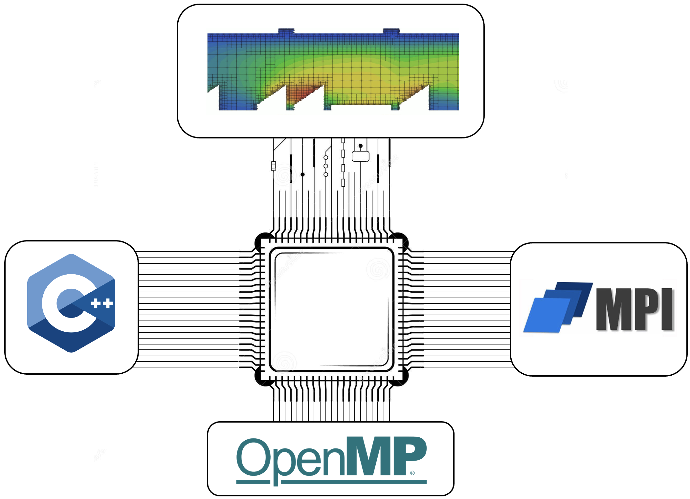

# Introduction to Parallel High Performance Programming - Code Base



## Installation Instructions

For compiling and running the code we use the terminal which as first glance is slightly more inconvenient but once you
get used to it, though, it's easier than clicking buttons.

#### Installation

First, we need to configure the project. Let's assume the project folder is located at `<path-to-i2phpp>`. When you open
the terminal, the first step is to change your working directory to the project folder:

```
cd <path-to-i2phpp>
```

Note that when opening the terminal from VSCode with VSCode being opened in the root directory of the project the current working directory of the new terminal is already correct. Next, we configure the project using a meta-build tool called **CMake**. If you're curious, you can take a look at the `CMakeLists.txt` file, which contains the cmake code that describes the project setup. However, for the purpose of this course, you can also simply let the cmake magic do its job by simply running:

```
cmake --preset=<build-type> .
```

Replace `<build-type>` with either `release` or `debug`, depending on your needs. The `release` mode tells the compiler
to optimize the code, which is useful when running benchmarks. If you're tracking down a bug, `debug` mode is your best
friend ;) — it allows you to use a debugger to analyze the code's behavior.

Once cmake finishes configuring the project, a new folder named `build/` will appear in your project directory. Inside
it, you'll find two subfolders: `release/` and `debug/`. If you only configured the project in one mode, you’ll only see the corresponding folder.

The next step is to compile the code. Based on your chosen mode, navigate to the appropriate subdirectory. For example,
if you configured the project in `release` mode:

```
cd build/release
```

Now, compile the code by running:

```
ninja -j <n_processes>
```

The `<n_processes>` parameter specifies how many compilation processes run in parallel. The ideal number depends on your
hardware and the project size. If you're unsure, `8` is generally a safe choice on modern systems. Once the command
finishes, the code is compiled and ready to run.

Note that you’ll need to recompile whenever you change your code. Reconfiguration with cmake is only necessary if you
modify `CMakeLists.txt`, add new source (`.cpp`) files, or change compiler flags. This won’t be required for the
exercises or worksheets unless explicitly mentioned. Of course, feel free to explore on your own!

#### Running the Tests

Once the code is compiled, you can run tests to verify your implementation and ensure modifications remain correct. The
test executables are located in the directory `<path-to-i2hpp>/build/<build-type>/tests`. Assuming your current working
directory is `build/<build-type>`, run a test with:

```bash
mpiexec -np <num_processes> ./tests/<test-name>
```

Replace `<num_processes>` with the number of desired processes, and `<test-name>` with the name of the test executable you want to run, such as `pi_estimation_test`. The terminal output will tell you whether the test passed or failed, and will provide details if it failed.

#### Running the Heat Equation Application

Besides the tests, you can also run the heat equation solver to tackle a more physically relevant problem. The solver is
compiled alongside the tests, so no additional compilation is needed. Assuming your current directory is `build/`, the
solver executable is located in the `applications/` folder.

To run the solver, you need a `.json` input file specifying parameters such as boundary conditions. You can find an
example input file in `<path-to-i2phpp>/doc/examples`.

Suppose you have an input file named `my_exciting_input.json` in `<example-directory>`. From the `build/` directory, run
the
solver with:

```
./applications/heat_equation <example-directory>/my_exciting_input.json
```

**Disclaimer:** Due to a parallel processing bug, output is currently unavailable. We apologize for the inconvenience. If you're looking for an extra challenge, feel free to tackle this issue as part of your bonus project!
